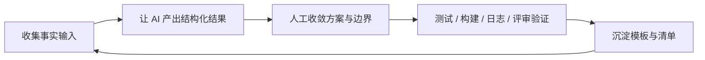

# 第0课草稿 A：工作流机制与验证链路

## 真实研发场景

很多团队已经把 AI 接进日常开发，但使用方式高度离散：有人把它当搜索引擎，有人让它直接写控制器和 Service，有人只在 PR 前让它帮忙扫一眼。表面上看，大家都在“用 AI”，但只要跨过一个迭代周期就会发现，团队吞吐并没有线性提升。需求照样反复澄清，接口照样返工，测试照样拖到最后，线上问题照样靠人肉翻日志。

问题不是“AI 没写出代码”，而是“团队没有重新设计研发动作”。如果一个动作的输入还是混乱的，输出还是散文式的，验证还是靠主观感觉，那么再强的模型也只是在加速混乱。

## 传统做法的痛点

### 个人提效和团队提效之间有一条断层

个人层面最容易看到的收益是“十分钟写完一段原来要半小时的代码”。但团队交付依赖的不是某一段代码，而是一串动作：

| 动作 | 传统问题 | 为什么 AI 容易失效 |
|------|----------|-------------------|
| 需求澄清 | 信息来自 IM、会议和口头共识 | 模型拿不到完整上下文，只能猜 |
| 设计收口 | 大家心里有方案，但没有结构化对齐 | 模型输出多个方案后无人拍板 |
| 编码实现 | 分层规则靠经验默契维持 | 模型会主动越界，把所有层一口气写完 |
| 测试与回归 | 验证动作滞后到最后 | 模型生成内容没有即时验收 |
| 发布与复盘 | 事实散落在日志、监控和聊天记录里 | 模型能总结，但事实源没有先收齐 |

### 三个最常见的断点

1. 没有输入约束。大家只说“帮我写一下”，不给现有代码、接口契约、异常约束、验收标准。
2. 没有结构化输出。模型返回一大段自然语言，团队不知道该怎么接下一步动作。
3. 没有验证闭环。输出被直接复制进代码、文档或结论，而不是进入测试、构建、日志或评审环节。

## AI 能提效到哪一步

AI 真正有价值的地方，不是替你完成整条研发链路，而是降低每个动作里的“理解成本”和“补齐成本”。

### 它特别适合四类动作

- 上下文归纳：把分散在 README、代码、日志和会议纪要里的事实先整理成结构化视图
- 候选方案生成：给出接口草图、模块切分、测试边界、发布清单等候选版本
- 低风险补齐：补测试数据、样例、文档初稿、异常分支、检查清单
- 差异总结：对比两个方案、两版接口、两组日志之间的主要变化

### 但它不适合替你完成这三类拍板

- 需求边界拍板：哪些需求必须做、哪些要延期，本质上是业务与工程共同决策
- 风险接受拍板：是否允许上线、是否接受性能退化、是否可以带病运行，不能交给模型
- 团队规范拍板：哪些模板成为标准、哪些输出视为验收通过，必须由团队负责人定义

## 推荐工作流

把 AI 放进后端研发时，建议使用固定闭环：

### 每一环都要能回答两个问题

| 环节 | 你要准备什么 | 你怎么判断这一环做对了 |
|------|---------------|------------------------|
| 收集事实输入 | 代码路径、配置、需求原文、已有测试、异常样本 | AI 不需要靠猜测补关键背景 |
| 结构化输出 | 问题清单、方案对比、字段表、测试矩阵 | 下游同事能直接接着做下一步 |
| 人工收敛 | 边界、取舍、优先级、不可做项 | 方案能说清为什么这样定 |
| 验证 | 测试、构建、日志、手工联调、文档审查 | 结果被证据支持，而不是被感觉支持 |
| 沉淀模板 | prompt、清单、验收标准、示例输出 | 下一次相似任务可以更快复用 |

如果团队只能记住一句话，那就是：**任何一次 AI 输出都必须指向一个可以验证的后续动作。**

## 与仓库代码和模板的映射

- [README.md](../../../../README.md)：整套课程总图，适合作为“研发动作地图”的起点
- [课程设计文档.md](../../../../课程设计文档.md)：明确 12 节主线课为什么按研发动作而不是按 AI 术语组织
- [demo/README.md](../../../../demo/README.md)：说明示例项目是教学素材库，这正是“输入上下文”的来源
- [ChatController.java](../../../../demo/src/main/java/com/example/ainative/chat/controller/ChatController.java) + [ChatControllerTest.java](../../../../demo/src/test/java/com/example/ainative/chat/controller/ChatControllerTest.java)：一边是实现，一边是验证，非常适合说明“生成”和“验收”必须成对出现

## 常见误用与风险

- 误用一：把 AI 当搜索框，不给项目上下文。结果是它说得头头是道，但和你的项目没有关系。
- 误用二：把 AI 当拍板人。它可以列方案，但不承担业务后果、线上事故后果和维护成本。
- 误用三：只统计“节省了多少写代码时间”，不统计“多花了多少验证和返工时间”。
- 误用四：个人用得很好，却没有把输入模板、验收标准和示例输出沉淀下来，导致团队无法复制。

## 课后练习

1. 画出你团队的一条后端研发闭环，至少标出需求澄清、设计、编码、测试、发布五步。
2. 对其中两个动作补齐“输入 -> AI 输出 -> 验证方式 -> 沉淀模板”。
3. 列出三个不能交给 AI 直接拍板的工程决策，并解释原因。
