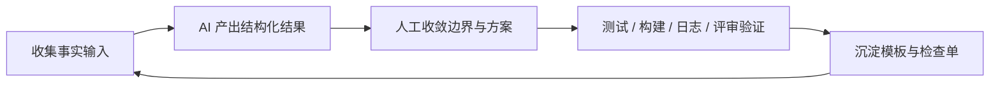

# 第0课 AI 时代后端工程师的工作流重构

这节课是整套训练营的入口。它不解决某个具体 API 怎么写，也不讨论某个模型参数怎么调，而是先回答一个更根本的问题：**为什么很多团队已经在用 AI 了，交付方式却没有真正变得更稳、更快、更可复制。**

## 真实研发场景

### 团队里已经有人在用 AI，但结果非常不均匀

一个典型的后端团队里，常见画面是这样的：有人已经习惯让 AI 帮忙看需求、起接口草稿、补测试和写 PR 说明；也有人只在卡住时偶尔问一句；还有人对 AI 仍然保持谨慎，担心生成代码看起来快、实际返工更大。结果就是，团队层面虽然已经“采用了 AI”，但收益分布极不均匀。

这类场景里真正的问题，往往不是“模型写不出代码”，而是团队没有统一回答下面这些问题：

- 哪些研发动作值得优先让 AI 参与
- 每个动作要给 AI 什么输入
- AI 应该输出什么结构化结果
- 这些结果如何被测试、构建、日志或评审验证
- 哪些成功做法会沉淀成团队模板

### 这节课真正要建立的是一张研发动作地图

如果没有这张地图，AI 就只能以“高手个人技巧”的方式存在。某个人可能能靠自己的经验问出很好的结果，但一旦换一个人、换一个场景、换一个迭代周期，质量就开始飘。训练营后面 11 节课会分别拆开需求、设计、编码、测试、联调、排障、发布和团队规范，但在进入细节之前，必须先建立一个总原则：**AI 不是替代整条研发链路，而是嵌进每一个研发动作里，帮助你更快看清上下文、生成候选方案、补齐低风险产物，并把结果引向验证。**

## 传统做法的痛点

### 个人提效不会自动变成团队提效

很多团队对 AI 的第一轮感知是“有人写代码明显更快了”。这是真收益，但它只覆盖了研发流程里最容易被看见的局部。团队真正的交付效率，取决于整条链路是否顺畅：需求有没有先说清，接口有没有收口，代码有没有守住边界，测试和回归有没有跟上，发布和复盘有没有沉淀为模板。

下面这张表能说明为什么“会用 AI”不等于“工作流已经升级”：

| 研发动作 | 传统断点 | 只靠零散使用 AI 为什么不够 |
|----------|----------|---------------------------|
| 需求澄清 | 信息散落在会议、IM、文档和口头共识里 | 模型拿不到完整上下文，只能补猜测 |
| 设计收口 | 大家都有想法，但没有统一格式对齐 | 模型能给方案，却没人定义拍板标准 |
| 代码实现 | 分层规则靠经验维持 | 模型很容易一口气把多层职责写串 |
| 测试回归 | 验证动作总被压到最后 | 没有及时校验，生成结果很难早发现偏差 |
| 发布复盘 | 事实分散在日志、面板和聊天记录里 | 模型会总结，但前提是证据先被收齐 |

### 真正让团队吃亏的是三种“断链”

1. 输入断链：需求、代码、配置、测试样本没有被结构化整理给 AI，导致模型在关键地方凭空猜。
2. 输出断链：模型输出一长段自然语言，没有变成问题清单、字段表、测试矩阵、检查单这类可执行结果。
3. 验证断链：生成内容没有进入测试、构建、日志分析或评审动作，而是直接被采纳。

这也是为什么很多团队明明“经常用 AI”，却仍然觉得结果不稳定。问题不在模型本身，而在于工作流没有形成闭环。

## AI 能提效到哪一步

### AI 最适合承担的是“整理、候选、补齐、总结”

从后端工程的视角看，AI 最稳定的价值并不在于“自动把功能写完”，而在于降低每个动作里的理解成本和遗漏成本。通常最值得优先让 AI 参与的是下面四类工作：

- 上下文整理：把 README、代码路径、需求原文、测试、日志和限制条件先整理成结构化输入
- 候选方案生成：列出接口字段、模块切分、风险点、测试边界或发布检查项
- 低风险补齐：补样板代码、异常分支、样例数据、文档初稿和检查清单
- 差异总结：比较两个方案、两版接口、两组日志或两次发布结果之间的关键差异

这些动作有一个共同点：它们都能帮助工程师更快做判断，但不会替代工程师承担判断后果。

### 不该外包给 AI 的，是带责任的拍板

下面这些事情可以参考 AI 的意见，但不应该直接外包给模型：

| 决策类型 | 为什么不能直接交给 AI |
|----------|------------------------|
| 需求边界拍板 | 涉及业务优先级、资源约束和交付承诺 |
| 风险接受拍板 | 涉及线上后果、可接受故障范围和责任边界 |
| 架构与分层拍板 | 涉及长期维护成本，不是一次生成结果能替代 |
| 上线与否拍板 | 必须基于测试、监控、变更范围和事故成本综合判断 |

一个很实用的判断标准是：**如果这一步出错后需要团队承担真实代价，那 AI 最多只能做候选，不该做裁判。**

### 何时值得让 AI 介入，何时应该先补上下文

- 如果当前动作主要痛点是“信息太散、总结太慢、容易遗漏”，AI 往往能立刻见效。
- 如果当前动作主要痛点是“边界还没定、取舍还没收口”，先别急着让 AI 生成大段结果，先把约束讲清楚。
- 如果你还没想好怎么验证结果，说明还不适合让 AI 直接进入产出阶段。

## 推荐工作流

### 把每次 AI 协作都压缩成一个最小闭环

最稳的落地方式不是追求“让 AI 干更多活”，而是把一次 AI 协作放进一个固定闭环：



这个闭环的关键不在于图画得多漂亮，而在于每一环都要明确输入、输出和验证方式。

### 一个能落地的五步法

| 步骤 | 你要做什么 | 这一环的产物 | 验证方式 |
|------|------------|--------------|----------|
| 1. 定义动作 | 先说清这一步到底要解决什么问题 | 当前动作说明 | 团队成员是否都能理解目标 |
| 2. 收集事实 | 准备需求原文、代码路径、配置、现有测试、异常样本 | 事实包 | AI 是否还需要补猜关键背景 |
| 3. 结构化提问 | 要求 AI 输出问题清单、字段表、测试矩阵、检查单等 | 结构化候选结果 | 下游是否能直接继续执行 |
| 4. 人工收敛 | 删除不合理项，补上模型看不到的边界和限制 | 可执行版本 | 是否说清为什么这样取舍 |
| 5. 验证与沉淀 | 用测试、构建、日志、评审收口，再把有效模板留下来 | 验证结果 + 模板 | 下一次相似任务能否更快复用 |

### 推荐使用的最小输入模板

```md
当前动作：
已有事实：
相关代码或文档：
不确定点：
希望 AI 输出：
禁止越界的事项：
验证方式：
```

这个模板看起来朴素，但它会逼你在开口之前先想清楚三件事：你到底在做哪一步、你已经掌握了哪些事实、你准备怎么判断结果是否可用。很多“AI 不稳定”的根源，其实是这三件事没有被先讲明白。

## 与仓库代码和模板的映射

### 用顶层文档建立整套主线地图

- 课程总览：[README.md](../README.md)
  这里能看到 12 节主线课和 4 个进阶专题如何分工，适合拿来画研发动作总图。
- 设计依据：[课程设计文档.md](../课程设计文档.md)
  这里明确规定了主线课程统一采用 7 段结构，也解释了为什么课程不是按 AI 术语，而是按后端研发动作组织。
- 练习说明：[课后练习/README.md](../课后练习/README.md)
  这里强调所有练习都要求结构化产物和验证动作，正好对应本课的“闭环”观点。

### 用 `demo/` 理解什么叫“真实上下文”

- 示例项目说明：[demo/README.md](../demo/README.md)
  它明确说 `demo/` 是教学素材库，不是要求学员一步步搭成终态产品，这非常适合拿来训练“如何给 AI 足够上下文”。
- 控制器与服务边界：[demo/src/main/java/com/example/ainative/chat/controller/ChatController.java](../demo/src/main/java/com/example/ainative/chat/controller/ChatController.java)、[demo/src/main/java/com/example/ainative/chat/service/ChatService.java](../demo/src/main/java/com/example/ainative/chat/service/ChatService.java)
  这组文件适合说明“实现生成”应该落在什么颗粒度，哪些职责不该混在一起。
- 验证资产：[demo/src/test/java/com/example/ainative/chat/controller/ChatControllerTest.java](../demo/src/test/java/com/example/ainative/chat/controller/ChatControllerTest.java)、[demo/src/test/java/com/example/ainative/chat/service/ChatServiceTest.java](../demo/src/test/java/com/example/ainative/chat/service/ChatServiceTest.java)
  这组文件适合说明“AI 参与实现”必须和“验证行为”成对出现。
- 最小评测样例：[demo/evals/regression/README.md](../demo/evals/regression/README.md)
  这里能看到回归评测是如何被单独表达成资产的，这就是“沉淀模板”的例子。

## 常见误用与风险

### 误用一：把 AI 当搜索引擎，却不给项目上下文

这类用法最容易得到“看起来很像答案”的内容，但一落到真实代码、真实配置、真实限制上就开始失真。修正方式不是让 prompt 更华丽，而是先把事实包准备好。

### 误用二：把 AI 当拍板人，而不是候选方案生成器

模型可以帮你列方案、补表格、做摘要，但它不承担业务优先级、上线风险和长期维护成本。凡是涉及责任归属的决策，都应该由工程师或负责人拍板。

### 误用三：只看生成速度，不看验证成本

如果十分钟生成了一堆代码，但后来花了两小时排查边界错误、补测试和重写 PR 说明，这并不是真正提效。更健康的指标应该是“从问题到可验证结果”的总成本有没有下降。

### 误用四：个人用得很好，却没有沉淀成团队模板

一个高手的本地 prompt 收藏夹不是团队能力。只有当输入模板、输出格式、验证动作和成功样例被公开沉淀后，团队才算真正建立了 AI 协作方式。

### 误用五：在没有验证路径时就让 AI 深度生成

如果你还说不清“这一步做完后怎么验”，那就先别让 AI 产出大段正文、接口或实现。先补上验证路径，再谈生成效率。

## 课后练习

### 基础题：画出一条你所在团队的研发闭环

至少标出需求澄清、设计收口、实现、测试、发布五个动作，并说明每一步当前主要靠什么输入推进。

### 进阶题：为两个动作补齐 AI 协作模板

从你最常见的两个动作里挑两个，为每个动作写出：

- 当前动作说明
- 已有事实
- 希望 AI 输出
- 禁止越界事项
- 验证方式

### 挑战题：写一份团队级 AI 使用边界清单

这份清单至少要回答：

- 哪些动作可以先让 AI 起草
- 哪些决策不能直接交给 AI
- AI 输出进入什么验证动作后才算可采纳
- 哪些成功做法需要沉淀成模板

如果你能把这份清单写清楚，后面 11 节课就不再是零散技巧，而会变成一套可复制的工作流升级方案。
